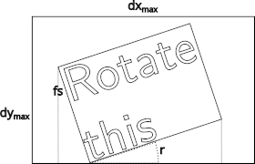

Drawing
=======

This document explains the internal details about how ETE draws trees
on the browser.

The :mod:`smartview <ete4.smartview>` module contains a
:func:`draw <ete4.smartview.draw.draw>` function that
takes mainly a tree and a viewport, and can produce a list of
graphical commands.

Graphical Commands
------------------

The :func:`draw function <ete4.smartview.draw.draw>` is a generator
that yields :mod:`graphical commands <ete4.smartview.graphics>`. They
are mainly a description of basic graphic items, which are lists that
look like::

  ['hz-line', [0.0, 0.5], [8.0, 0.5], [], '']

It always starts with the name of the graphical command, followed by
its parameters. (This is similar to creating a `DSL
<https://en.wikipedia.org/wiki/Domain-specific_language>`_ with
functions that draw, and which will be interpreted in the frontend.)

gui.js
------

When the browser opens a tree, it will see the file
``ete4/smartview/static/gui.html``. This is a simple web page, which
loads ``js/gui.js`` to provide all the functionality.

The code in ``gui.js`` loads many different modules to visualize and
interact with trees. It contains an object ``view`` (with information
on the current view of the tree) which is a sort of global variable
repository. This is mainly used in the menus to expose and control its
values.

Drawing areas
-------------

They can be seen in ``gui.html``. They are::

   div_tree
   div_aligned
   div_legend
   div_minimap

API calls
---------

When starting to browse a tree, we see this order of :doc:`api calls
<internals_api>`::

  /trees

  /trees/tree-1/layouts

  /trees/tree-1/style?active=["basic","Example+layout"]

  /trees/tree-1/size

  /trees/tree-1/nodecount

  /trees/tree-1/properties

  /static/images/spritesheet.json

  /static/images/spritesheet.png

  /trees/tree-1/draw?shape=rectangular&node_height_min=30&content_height_min=4&zx=1.2&zy=362.7&x=-0.3&y=-0.1&w=3.3&h=3.3&collapsed_shape=skeleton&collapsed_ids=[]&layouts=["basic","Example+layout"]&labels=[]

and from that moment, when moving and zooming the tree, typically many
similar draw calls like::

  /trees/tree-1/draw?shape=rectangular&node_height_min=30&content_height_min=4&zx=1.4[...]

And there are different kind of api calls made when editing or changing
the tree in different ways.

Code paths
~~~~~~~~~~

The initial api calls come from the following places in the code:

::

  gui.js
    main
      init_trees  # /trees
      populate_layouts  # /trees/tree-1/layouts
      set_tree_style  # /trees/tree-1/style?active=["basic","Example+layout"]
      set_consistent_values  # /trees/tree-1/size
      store_node_count  # /trees/tree-1/nodecount
      store_node_properties  # /trees/tree-1/properties
      init_pixi  # /static/images/spritesheet.json /static/images/spritesheet.png
      update  # (in draw.js)
        draw_tree  # /trees/tree-1/draw?[...]

Faces
-----

The :mod:`faces submodule <ete4.smartview.faces>` provides several
predefined faces. They all derive from the :class:`Face
<ete4.smartview.faces.Face>` base class.

To create a new face, we just need to create a class (normally derived
from :class:`Face <ete4.smartview.faces.Face>`) with a constructor and
a ``draw`` function:

- The constructor takes at least the arguments ``position``,
  ``column``, and ``anchor``
- The ``draw`` function takes a set of predefined arguments, and
  returns a list of graphic commands and the total size occupied by
  the drawing (in tree coordinates)

Their behavior is well documented in the base class itself::

  class Face:
      """Base class.

      It contains a position ("top", "bottom", "right", "left",
      "aligned", "header"), a column (an integer used for relative order
      with other faces in the same position), and an anchor point (to
      fine-tune the position of things like texts within them).
      """

      def __init__(self, position='top', column=0, anchor=None):
          """Save all the parameters that we may want to use."""
          self.position = position  # 'top', 'bottom', 'right', etc.
          self.column = column  # integer >= 0
          self.anchor = anchor or default_anchors[position]  # tuple

      def draw(self, nodes, size, collapsed, zoom=(1, 1), ax_ay=(0, 0), r=1):
          """Return a list of graphic elements and the actual size they use.

          The retuned graphic elements normally depend on the node(s).
          They have to fit inside the given size (dx, dy) in tree
          coordinates (dx==0 means no limit for dx, and same for dy==0).

          If collapsed==[], nodes contains only one node (and is not collapsed).
          Otherwise, nodes (== collapsed) is a list of the collapsed nodes.

          The zoom is passed in case the face wants to represent
          things differently according to its size on the screen.

          ax_ay is the anchor point within the box of the given size
          (from 0 for left/up, to 1 for right/down).

          r * size[1] * zoom[1] is the size in pixels of the left
          border, whether we are in rectangular or circular mode.
          """
          graphic_elements = []  # like [draw_text(...), draw_line(...), ...]

          size_used = Size(0, 0)

          return graphic_elements, size_used

Rotations
---------

To find the font size :math:`\text{fs}` to use in the rotated texts,
which we use in :func:`TextFace and related <ete4.smartview.faces.texts_size>`,
we first make sure that it is smaller than :math:`\text{fs}_\max`, and
then, we take into account that the text is limited by the size of the
box :math:`(dx_\max, dy_\max)`:

where :math:`r` is the rotation angle, and the actual size of the box
*in pixels* would be :math:`(dx_\max \, z_x, dy_\max \, z_y)`. From
there, calling :math:`n_m` the number of characters in the longest
line of the text, and :math:`n_r` the number of rows of text, we have
that for the text to fit, its font size :math:`\text{fs}` must
satisfy:

.. math::

   dx_\max \, z_x > \cos r \frac{\text{fs}}{1.5} n_m + \sin r \, \text{fs} \, n_r \\
   dy_\max \, z_y > \sin r \frac{\text{fs}}{1.5} n_m + \cos r \, \text{fs} \, n_r

and from there, we can find the font size that fits in both dimensions
this way:

.. math::

   \text{fs} \leftarrow \min\{ && \frac{dx_\max \, z_x}{\cos r \frac{n_m}{1.5} + \sin r \, n_r}, \\
                               && \frac{dy_\max \, z_y}{\sin r \frac{n_m}{1.5} + \cos r \, n_r} \}

The resulting size used is then:

.. math::

   dx = \frac{\text{fs}}{z_x} \left( \cos r \frac{n_m}{1.5} + \sin r \, n_r \right) \\
   dy = \frac{\text{fs}}{z_y} \left( \sin r \frac{n_m}{1.5} + \cos r \, n_r \right)
