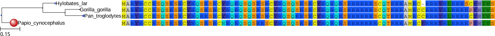
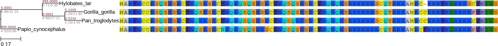

:Author: François Serra

.. currentmodule:: ete_dev

Testing Evolutionary Hypothesis
*******************************

.. contents::

Overview
================

An other aspect in the study of evolutionary history, is the analysis of selective pressures accounting for the conservation or degeneration of **protein coding genes**.

The :class:`EvolTree` class is an extension of the class :class:`PhyloTree` that implements mainly bindings to the PAML package [yang2007]_ but also to the SLR program.

Evolutionary variables that are used to summary selective pressures are, of course the branch-length (*bL*) already available in :class:`PhyloTree`, but also the rate of non-synonymous mutations (*dN*), the rate of synonymous mutations (*dS*) and finally the :math:`\omega` ratio: 

.. math::
  :nowrap:

  \begin{eqnarray}
    \omega = \frac{dN}{dS}
  \end{eqnarray}

Descriptive analysis
====================

In order to identify the evolutionary trends in a phylogenetic tree, one can either:
  * conduct an analysis over branches and compute the value of :math:`\omega` in each of them.
  * look at the selective pressures along the alignment.

Branch model
--------------

As for :class:`PhyloTree`, we first load the tree and alignment:

::
  
  from ete_dev import EvolTree

  tree = EvolTree("((Hylobates_lar,(Gorilla_gorilla,Pan_troglodytes)),Papio_cynocephalus);")
  
  tree.link_to_alignment ('''>Hylobates_lar
  ATGGCCAGGTACAGATGCTGCCGCAGCCAGAGCCGGAGCAGATGTTACCGCCAGAGCCGGAGCAGATGTTACCGCCAGAGGCAAAGCCAGAGTCGGAGCAGATGTTACCGCCAGAGCCAGAGCCGGAGCAGATGTTACCGCCAGAGACAAAGAAGTCGGAGACGAAGGAGGCGGAGCTGCCAGACACGGAGGAGAGCCATGAGGTGT---CGCCGCAGGTACAGGCTGAGACGTAGAAGCTGTTACCACATTGTATCT
  >Papio_cynocephalus
  ATGGCCAGGTACAGATGCTGCCGCAGCCAGAGCCGAAGCAGATGCTATCGCCAGAGCCGGAGCAGATGTAACCGCCAGAGACAGAGCCAAAGCCGGAGAAGCTGCTATCGCCAGAGCCAAAGCCGGAGCAGATGTTACCGCCAGAGACAGAGAAGTCGTAGACGAAGGAGGCGACGCTGCCAGACACGGAGGAGAGCCATGAGGTGCTTCCGCCGCAGGTACAGGCTGAGGCGTAGGAGGCCCTATCACATCGTGTCT
  >Gorilla_gorilla
  ATGGCCAGGTACAGATGCTGTCGCAGCCAGAGCCGCAGCAGATGTTACCGGCAGAGCCGGAGCAGGTGTTACCGGCAGAGACAAAGCCAGAGCCGGAGCAGATGCTACCGGCAGAGCCAAAGCCGGAGCAGGTGTTACCGGCAGAGACAAAGAAGTCGCAGACGTAGGCGGAGGAGCTGCCAGACACGGAGGAGAGCCATGAGGTGCTGCCGCCGCAGGTACAGACTGAGACGTAGAAGACCCTATCATATTGTATCT
  >Pan_troglodytes
  ATGGCCAGGTACAGATGCTGTCGCAGCCAGAGCCGGAGCAGATGTTACCGGCAGAGACGGAGCAGGTGTTACCGGCAAAGGCAAAGCCAAAGTCGGAGCAGATGTTACCGGCAGAGCCAGAGACGGAGCAGGTGTTACCGGCAAAGACAAAGAAGTCGCAGACGAAGGCGACGGAGCTGCCAGACACGGAGGAGAGCCATGAGGTGCTGCCGCCGCAGGTACAGACTGAGACGTAAAAGATGTTACCATATTGTATCT''')  

Once loaded we are able to compute selective pressure among the tree according to an evolutionary model. In this case, we will use free-ratio model:
::
  
  tree.run_model ('fb.example')
  
:func:`ete_dev.EvolNode.run_model` allows to run different evolutionary models (follow this link :func:`ete_dev.EvolNode.run_model` to see the full list of models available). By convention, the name of the model called is the first word, the rest of the string, after the dot, corresponds to its identifier in order to differentiate different runs of one model. We can thus either run "fb" model and "fb.something" with the same result, but they will be stored under different names instead of being overwritten.

Once computation is done, we can retrieve the :class:`ete_dev.evol.Model` object from the tree, with the :func:`ete_dev.EvolNode.get_evol_model` function.

::
  
  my_first_fb_model = tree.get_evol_model('fb.example')

  print my_first_fb_model
  #  Evolutionary Model fb.example:
  #      log likelihood      : -525.772495
  #      number of parameters: 8

By default, the free-branch model is run with this parameters:

::

    print my_first_fb_model.get_ctrl_string()

    #      seqfile = algn
    #     treefile = tree
    #      outfile = out
    #  
    #       aaDist = 0
    #    fix_alpha = 1
    #        alpha = 0.0
    #  fix_blength = 0
    #    cleandata = 0
    #        clock = 0
    #    CodonFreq = 2
    #        getSE = 0
    #        icode = 0
    #    fix_kappa = 0
    #        kappa = 2
    #       Malpha = 0
    #       method = 0
    #        Mgene = 0
    #        model = 1
    #        ncatG = 8
    #        noisy = 0
    #      NSsites = 0
    #    fix_omega = 0
    #        omega = 0.7
    # RateAncestor = 0
    #      runmode = 0
    #      seqtype = 1
    #   Small_Diff = 1e-6
    #      verbose = 2

However, it is usually recommended to run one model several times with different starting values, and keep only the model with higher likelihood. Here an example, on how to do this.

::

  best_model = None
  best_lnl   = float('-inf')
  for starting_omega in [0.2, 0.7, 1.2]:
      tree.run_model('fb.'+str(starting_omega))
      current_model = tree.get_evol_model('fb.'+str(starting_omega))
      print 'current model log likelihood:', current_model.lnL
      if current_model.lnL > best_lnl:
          best_lnl = current_model.lnL
          best_model = current_model
      
Finally in order to have a quick look of the selctive pressures over our phylogeny:

::

  t.show()

by default this will the picture obtained:

.. _fb_default-fig:

      

Node size, and color dependant of the :math:`\omega` value. But other displays are available:

::

  from ete_dev.treeview.layouts import evol_clean_layout

  tree.show(layout=evol_clean_layout)

.. _fb_clean-fig:

  

With here :math:`\omega` ratios in red and also in gray the *dN* and *dS* values.

Site model
-----------

References
==========

.. [yang2007] Yang, Z., PAML 4: phylogenetic analysis by maximum likelihood. Molecular biology and evolution 24: 1586-91. (2007)
