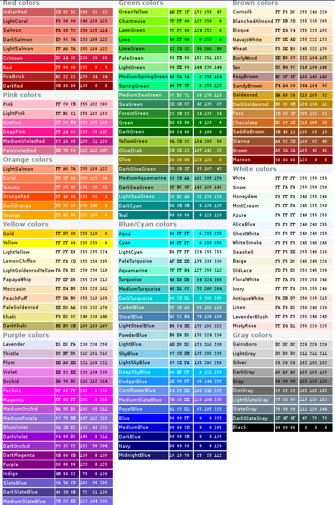

:Author: Jaime Huerta-Cepas

.. currentmodule:: ete_dev

The Programmable Tree Drawing Engine
************************************

ETE's treeview extension provides a highly programmable drawing system
to render any hierarchical tree structure as PDF, SVG or PNG
images. Although several predefined visualization layouts are included
with the default installation, custom styles can be easily created
from scratch.

Image customization is performed through four elements: **a)**
:class:`TreeStyle`, setting general options about the image (shape,
rotation, etc.), **b)** :class:`NodeStyle`, which defines the
specific aspect of each node (size, color, background, line type,
etc.), **c)** node :class:`faces.Face` which are small pieces of extra
graphical information that can be added to nodes (text labels, images,
graphs, etc.) **d)** a :attr:`layout` function, a normal python
function that controls how node styles and faces are dynamically added
to nodes.

Images can be rendered as **PNG**, **PDF** or **SVG** files using the
:func:`TreeNode.render` method or interactively visualized using a
built-in Graphical User Interface (GUI) invoked by the
:func:`TreeNode.show` method.

Interactive visualization of trees
==================================

ETE's tree drawing engine is fully integrated with a built-in
graphical user interface (GUI). Thus, ETE allows to visualize trees
using an interactive interface that allows to explore and manipulate
node's properties and tree topology.  To start the visualization of a
node (tree or subtree), you can simply call the :func:`TreeNode.show`
method.

One of the advantages of this on-line GUI visualization is that you
can use it to interrupt a given program/analysis, explore the tree,
manipulate them, and continuing with the execution thread. Note that
**changes made using the GUI will be kept after quiting the
GUI**. This feature is specially useful for using during python
sessions, in which analyses are performed interactively.

The GUI allows many operations to be performed graphically, however it
does not implement all the possibilities of the programming toolkit.

:: 

  from ete_dev import Tree 
  t = Tree( "((a,b),c);" )
  t.show()

Rendering trees as images
=============================

Tree images can be directly written as image files. SVG, PDF and PNG
formats are supported. Note that, while PNG images are raster images,
PDF and SVG pictures are rendered as `vector graphics
<http://en.wikipedia.org/wiki/Vector_graphics>`_, thus allowing its
later modification and scaling.

To generate an image, the :func:`TreeNode.render` method should be
used instead of :func:`TreeNode.show`. The only required argument is
the file name, whose extension will determine the image format (.PDF,
.SVG or .PNG). Several parameters regarding the image size and
resolution can be adjusted:

.. table::

   ================= ==============================================================
   Argument           Description
   ================= ==============================================================
   :attr:`units`     "**px**": pixels, "**mm**": millimeters, "**in**": inches
   :attr:`h`         height of the image in :attr:`units`.       
   :attr:`w`         weight of the image in :attr:`units`.
   :attr:`dpi`       dots per inches.
   ================= ==============================================================

.. note:: 

   If :attr:`h` and :attr:`w` values are both provided, image size
   will be adjusted even if it requires to break the original aspect
   ratio of the image. If only one value (:attr:`h` or :attr:`w`) is
   provided, the other will be estimated to maintain aspect ratio. If
   no sizing values are provided, image will be adjusted to A4
   dimensions.

:: 

  from ete_dev import Tree 
  t = Tree( "((a,b),c);" )
  t.render("mytree.png", w=183, units="mm")

Customizing tree aspect
=======================

Image customization is performed through four main elements:

Tree style 
-------------------

The :class:`TreeStyle` class can be used to create a custom set of
options that control the general aspect of the tree image. Tree styles
can be passed to the :func:`TreeNode.show` and :func:`TreeNode.render`
methods.  For instance, :class:`TreeStyle` allows to modify the scale
used to render tree branches or choose between circular or rectangular
tree drawing modes.

:: 

  from ete_dev import Tree, TreeStyle

  t = Tree( "((a,b),c);" )
  circular_style = TreeStyle()
  circular_style.mode = "c" # draw tree in circular mode
  circular_mode.scale = 20
  t.render("mytree.png", w=183, units="mm", tree_style=circular_style)
  
A number of parameters can be controlled through custom tree style
objetcs, check :class:`TreeStyle` documentation for a complete list of
accepted values.

Node style
-------------------

Through the :class:`NodeStyle` class the aspect of each single node
can be controlled, including its size, color, background and branches.

A node style can be defined statically and attached to several nodes: 

:: 

  from ete_dev import Tree, NodeStyle
  t = Tree( "((a,b),c);" )
  nstyle = NodeStyle()
  
  # Draws nodes as small red spheres of diameter equal to 10 pixels
  nstyle["shape"] = "sphere"   
  nstyle["size"] = 10  
  nstyle["fgcolor"] = "darkred" 

  # Gray dashed branch lines
  nstyle["hz_line_type"] = 1 
  nstyle["hz_line_type"] = "#cccccc" 

  # Applies the same static style to all nodes in the tree
  for n in t.traverse():
     n.set_style(nstyle)

  t.show() 

A '**style**' is a set of special node attributes that are used by the drawing
algorithm to set the colours, and general aspect of nodes and branches. Styles
are internally encoded as python dictionaries. Each node has its own style
dictionary, which is accessible as **node.img_style**. A default style is
associated to every tree node, but you can modify them at any time. Note that
**nodes styles must only be modified inside a layout function**. Otherwise,
custom settings may be missing or overwritten by default values.

Faces
-----

**Node's faces** are more sophisticated drawing features associated to nodes.
They represent independent images that can be linked to nodes, usually
representing a given node's feature. Faces can be loaded **from external image
files**, **created from scratch** using any drawing library, **or generated as
text labels**.

The complexity of faces may go from simple text tags to complete plots showing
the average expression pattern associated to a given partition in a microarray
clustering tree. Given that faces can be loaded from external images and added
*on the fly*, any way of producing external images could be easily connected to
the drawing engine. For instance, the statistical framework R could be used to
analyze a given node's property, and to generate a plot that can be used as a
node's face.

To create a face, the following general constructors can be used, which are
**available through the face module**:

.. % 

Once a face is created, it can be linked to one or more nodes. To do so, you
must use the **add_face_to_node() **method within the** faces** module. By doing
this, when a node is drawn, their linked faces will be drawn beside it. Since
several faces can be added to the same node, you must specify the relative
position in which they will be placed. Each node reserves a virtual space that
controls how faces are positioned. The position of each face is determined by an
imaginary grid at the right side of each node (Figure :ref:`fig:faces
positions`). Each column from the grid is internally treated as a stack of
faces. Thus, faces can be added to any column and its row position will be
determined by insertion order: **first inserted is first row**. In the case of
trees leaves, nodes can handle an independent list of faces that will be drawn
aligned with the farthest leaf in the tree. To add an aligned face you can use
the **aligned=True **argument** **when calling the **add_face_to_node()**
method. By knowing this rules, you can easily fill virtual node grids with any
external image or text label and the algorithm will take care of positioning.
Note that** add_face_to_node()** must only be used inside a layout function.

.. % 

layouts
-------

**Layout functions** are the key component of the tree drawing customization.
Any python function accepting a node instance as a first argument can be used as
a layout function. Essentially, such function will be called just before drawing
each tree node, so you can use it perform any operation prior to render nodes.
In practice, layout functions are used to define the set of rules that control
nodes style attributes and the faces that will be linked to them. Of course,
such rules can be based on a previous node analysis. For instance: ``if node has
more than 5 descendants, then add a text label, set a different background
color, perform an analysis on leaves and associate an external image`` with
node. As you imagine, rules can be are as sophisticated as you want. Thus, the
advantage of this method is that you can create your own drawing algorithms to
render trees dynamically and fitting very specific needs.

In order to apply your custom layouts functions, function's name (the reference
to it) can be passed to both **render()** and **show()** methods:
``node.render(``\ filename.pdf'', layout=mypythonFn) ``**or**``
node.show(layout=mypythonFn)``.

Example: combining styles, faces and layouts
--------------------------------------------

