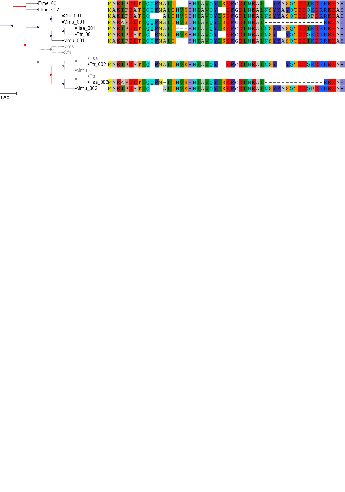

.. moduleauthor:: Jaime Huerta-Cepas

.. :author:: Jaime Huerta-Cepas

.. currentmodule:: ete2

Phylogenetic Trees
********************

.. contents::

Overview
================

Phylogenetic trees are the result of most evolutionary analyses. They
represent the evolutionary relationships among a set of species or, in
molecular biology, a set of homologous sequences.

The :class:`PhyloTree` class is an extension of the base :class:`Tree`
object, providing a appropriate way to deal with phylogenetic trees.
Thus, while leaves are considered to represent species (or sequences
from a given species genome), internal nodes are considered ancestral
nodes. A direct consequence of this is, for instance, that every split
in the tree will represent a speciation or duplication event.

Linking Phylogenetic Trees with Multiple Sequence Alignments
================================================================

:class:`PhyloTree` instances allow molecular phylogenies to be linked
to the Multiple Sequence Alignments (MSA). To associate a MSA with a
phylogenetic tree you can use the :func:`PhyloNode.link_to_alignment`
method. You can use the :attr:`alg_format` argument to specify its
format (See :class:`SeqGroup` documentation for available formats)

Given that Fasta format are not only applicable for MSA but also for
**Unaligned Sequences**, you may also associate sequences of different
lengths with tree nodes.

::
  
  from ete2 import PhyloTree
  fasta_txt = """
  >seqA
  MAEIPDETIQQFMALT---HNIAVQYLSEFGDLNEALNSYYASQTDDIKDRREEAH
  >seqB
  MAEIPDATIQQFMALTNVSHNIAVQY--EFGDLNEALNSYYAYQTDDQKDRREEAH
  >seqC
  MAEIPDATIQ---ALTNVSHNIAVQYLSEFGDLNEALNSYYASQTDDQPDRREEAH
  >seqD
  MAEAPDETIQQFMALTNVSHNIAVQYLSEFGDLNEAL--------------REEAH
  """

  # Load a tree and link it to an alignment.
  t = PhyloTree("(((seqA,seqB),seqC),seqD);")
  t.link_to_alignment(alignment=fasta_txt, alg_format="fasta") 

The same could be done at the same time the tree is being loaded, by
using the :attr:`alignment` and :attr:`alg_format` arguments of
:class:`PhyloTree`.

::

  # Load a tree and link it to an alignment. 
  t = PhyloTree("(((seqA,seqB),seqC),seqD);", alignment=fasta_txt, alg_format="fasta")

As currently implemented, sequence linking process is not strict,
which means that a perfect match between all node names and sequences
names **is not required**. Thus, if only one match is found between
sequences names within the MSA file and tree node names, only one tree
node will contain an associated sequence. Also, it is important to
note that sequence linking is not limited to terminal nodes. If
internal nodes are named, and such names find a match within the
provided MSA file, their corresponding sequences will be also loaded
into the tree structure. Once a MSA is linked, sequences will be
available for every tree node through its :attr:`node.sequence`
attribute.

.. literalinclude:: ../../examples/phylogenies/link_sequences_to_phylogenies.py

Visualization of phylogenetic trees
===================================

PhyloTree instances can benefit from all the features of the
programmable drawing engine. However, a built-in phylogenetic layout
is provided for convenience. 

All PhyloTree instances are, by default, attached to such layout for
tree visualization, thus allowing for in-place alignment visualization
and evolutionary events labeling. 

.. literalinclude:: ../../examples/phylogenies/phylotree_visualization.py

Adding taxonomic information
===============================
.. _taxonomic_info:

:class:`PhyloTree` instances allow to deal with leaf names and species
names separately.  This is useful when working with molecular
phylogenies, in which node names usually represent sequence
identifiers.  Species names will be stored in the
:attr:`PhyloNode.species` attribute of each leaf node. The method
:func:`PhyloNode.get_species` can be used obtain the set of species
names found under a given internal node (speciation or duplication
event).  Often, sequence names do contain species information as a
part of the name, and ETE can parse this information automatically. 

There are three ways to establish the species of the different tree
nodes:

+ Default: The three first letters of node's name represent the species 
+ The species code of each node is dynamically created based on node's name
+ The species code of each node is manually set.

Automatic control of species info
------------------------------------

::

  from ete2 import PhyloTree
  # Reads a phylogenetic tree (using default species name encoding)
  t = PhyloTree("(((Hsa_001,Ptr_001),(Cfa_001,Mms_001)),(Dme_001,Dme_002));")
  #                              /-Hsa_001
  #                    /--------|
  #                   |          \-Ptr_001
  #          /--------|
  #         |         |          /-Cfa_001
  #         |          \--------|
  #---------|                    \-Mms_001
  #         |
  #         |          /-Dme_001
  #          \--------|
  #                    \-Dme_002
  #
  # Prints current leaf names and species codes
  print "Deafult mode:"
  for n in t.get_leaves():
      print "node:", n.name, "Species name:", n.species
  # node: Dme_001 Species name: Dme
  # node: Dme_002 Species name: Dme
  # node: Hsa_001 Species name: Hsa
  # node: Ptr_001 Species name: Ptr
  # node: Cfa_001 Species name: Cfa
  # node: Mms_001 Species name: Mms

Automatic (and custom) control of the species info
----------------------------------------------------

The default behavior can be changed by using the
:func:`PhyloNode.set_species_naming_function` method or by using the
:attr:`sp_naming_function` argument of the :class:`PhyloTree` class.
Note that, using the :attr:`sp_naming_function` argument, the whole
tree structure will be initialized to use the provided parsing
function to obtain species name
information. :func:`PhyloNode.set_species_naming_function` (present in
all tree nodes) can be used to change the behavior in a previously
loaded tree, or to set different parsing function to different parts
of the tree.

::

  from ete2 import PhyloTree
  # Reads a phylogenetic tree
  t = PhyloTree("(((Hsa_001,Ptr_001),(Cfa_001,Mms_001)),(Dme_001,Dme_002));")

  # Let's use our own leaf name parsing function to obtain species
  # names. All we need to do is create a python function that takes
  # node's name as argument and return its corresponding species name.
  def get_species_name(node_name_string):
      # Species code is the first part of leaf name (separated by an
      #  underscore character)
      spcode = node_name_string.split("_")[0]
      # We could even translate the code to complete names
      code2name = {
        "Dme":"Drosophila melanogaster",
        "Hsa":"Homo sapiens",
        "Ptr":"Pan troglodytes",
        "Mms":"Mus musculus",
        "Cfa":"Canis familiaris"
        }
      return code2name[spcode]
   
  # Now, let's ask the tree to use our custom species naming function
  t.set_species_naming_function(get_species_name)
  print "Custom mode:"
  for n in t.get_leaves():
      print "node:", n.name, "Species name:", n.species

  # node: Dme_001 Species name: Drosophila melanogaster
  # node: Dme_002 Species name: Drosophila melanogaster
  # node: Hsa_001 Species name: Homo sapiens
  # node: Ptr_001 Species name: Pan troglodytes
  # node: Cfa_001 Species name: Canis familiaris
  # node: Mms_001 Species name: Mus musculus

Manual control of the species info
-------------------------------------

To disable the automatic generation of species names based on node
names, a ``None`` value can be passed to the
:func:`PhyloNode.set_species_naming_function` function. From then on,
species attribute will not be automatically updated based on the name
of nodes and it could be controlled manually. 

::

  from ete2 import PhyloTree
  # Reads a phylogenetic tree
  t = PhyloTree("(((Hsa_001,Ptr_001),(Cfa_001,Mms_001)),(Dme_001,Dme_002));")

  # Of course, you can disable the automatic generation of species
  # names. To do so, you can set the species naming function to
  # None. This is useful to set the species names manually or for
  # reading them from a newick file. Other wise, species attribute would
  # be overwriten
  mynewick = """
  (((Hsa_001[&&NHX:species=Human],Ptr_001[&&NHX:species=Chimp]),
  (Cfa_001[&&NHX:species=Dog],Mms_001[&&NHX:species=Mouse])),
  (Dme_001[&&NHX:species=Fly],Dme_002[&&NHX:species=Fly]));
  """
  t = PhyloTree(mynewick, sp_naming_function=None)
  print "Disabled mode (manual set)"
  for n in t.get_leaves():
      print "node:", n.name, "Species name:", n.species
   
  # node: Dme_001 Species name: Fly
  # node: Dme_002 Species name: Fly
  # node: Hsa_001 Species name: Human
  # node: Ptr_001 Species name: Chimp
  # node: Cfa_001 Species name: Dog
  # node: Mms_001 Species name: Mouse  

**Full Example:** :download:`Species aware trees
<../../examples/phylogenies/species_aware_phylogenies.py>`.

Detecting evolutionary events
=============================

There are several ways to automatically detect duplication and
speciation nodes. ETE provides two methodologies: One implements the
algorithm described in `Huerta-Cepas (2007)
<http://genomebiology.com/2007/8/6/R109>`_ and is based on the species
overlap (SO) between partitions and thus does not depend on the
availability of a species tree. The second, which requires the
comparison between the gene tree and a previously defined species
tree, implements a strict tree reconciliation algorithm (Page and
Charleston, 1997). By detecting evolutionary events, orthology and
paralogy relationships among sequences can also be inferred.  Find a
comparison of both methods in `Marcet-Houben and Gabaldon (2009)
<http://www.plosone.org/article/info:doi%2F10.1371%2Fjournal.pone.0004357>`_.

.. _spoverlap: 

Species Overlap (SO) algorithm
------------------------------

In order to apply the SO algorithm, you can use the
:func:`PhyloNode.get_descendant_evol_events` method (it will detect
all evolutionary events under the current node) or the
:func:`PhyloNode.get_my_evol_events` method (it will detect only the
evolutionary events in which current node, a leaf, is involved).

By default the **species overlap score (SOS) threshold** is set to
0.0, which means that a single species in common between two node
branches will rise a duplication event. This has been shown to perform
the best with real data, however you can adjust the threshold using
the ``sos_thr`` argument present in both methods.

.. literalinclude:: ../../examples/phylogenies/orthology_and_paralogy_prediction.py

Tree reconciliation algorithm
---------------------------------------

Tree reconciliation algorithm uses a predefined species tree to infer
all the necessary genes losses that explain a given gene tree
topology. Consequently, duplication and separation nodes will strictly
follow the species tree topology.

To perform a tree reconciliation analysis over a given node in a
molecular phylogeny you can use the :func:`PhyloNode.reconcile`
method, which requires a species :class:`PhyloTree` as its first
argument. Leaf node names in the the species are expected to be the
same species codes in the gene tree (see
`taxonomic_info`_). All species codes present in the
gene tree should appear in the species tree.

As a result, the :func:`PhyloNode.reconcile` method will label the
original gene tree nodes as duplication or speciation, will return the
list of inferred events, and will return a new **reconcilied tree**
(:class:`PhyloTree` instance), in which inferred gene losses are
present and labeled.

.. literalinclude:: ../../examples/phylogenies/tree_reconciliation.py

A closer look to the evolutionary event object
------------------------------------------------

Both methods, species overlap and tree reconciliation, can be used to
label each tree node as a duplication or speciation event. Thus, the
:attr:`PhyloNode.evoltype` attribute of every node will be set to one
of the following states: ``D`` (Duplication), ``S`` (Speciation) or
``L`` gene loss.

Additionally, a list of all the detected events is returned. Each
event is a python object of type :class:`phylo.EvolEvent`, containing
some basic information about each event ( :attr:`etype`,
:attr:`in_seqs`, :attr:`out_seqs`, :attr:`node`):

If an event represents a duplication, ``in_seqs`` **are all
paralogous** to ``out_seqs``. Similarly, if an event represents a
speciation, ``in_seqs`` **are all orthologous** to ``out_seqs``.

Relative dating phylogenetic nodes
=====================================

In molecular phylogeny, nodes can be interpreted as evolutionary
events. Therefore, they represent duplication or speciation events. In
the case of gene duplication events, nodes can also be assigned to a
certain point in a relative temporal scale. In other words, you can
obtain a relative dating of all the duplication events detected.

Although **absolute dating is always preferred and more precise**,
topological dating provides a faster approach to compare the relative
age of paralogous sequences (`read this
<http://bioinformatics.oxfordjournals.org/content/27/1/38.long>`_ for
a comparison with other methods, such as the use of synonymous
substitution rates as a proxy to the divergence time).

Some applications of topological dating can be found in `Huerta-Cepas
et al, 2007 <http://genomebiology.com/2007/8/6/r109>`_ or, more
recently, in `Huerta-Cepas et al, 2011
<http://bib.oxfordjournals.org/content/12/5/442.abstract>`_ or
`Kalinka et al, 2001
<http://www.nature.com/nature/journal/v468/n7325/full/nature09634.html>`_.

Implementation
------------------

The aim of relative dating is to establish a gradient of ages among
sequences. For this, a reference species needs to be fixed, so the
gradient of ages will be referred to that referent point.

Thus, if our reference species is `Human`, we could establish the
following gradient of species: 

+ \(1) Human -> (2) Other Primates -> (3) Mammals -> (4) Vertebrates

So, nodes in a tree can be assigned to one of the above categories
depending on the sequences grouped. For instance: 

+ A node with only human sequences will be mapped to (1). 
+ A node with human and orangutan sequences will be mapped to (2)
+ A node with human a fish sequences will be mapped to (4)

This simple calculation can be done automatically by encoding the
gradient of species ages as Python dictionary.

:: 

  relative_dist = {
      "human": 0, # human
      "chimp": 1, # Primates non human
      "rat":   2, # Mammals non primates
      "mouse": 2, # Mammals non primates
      "fish":  3  # Vertebrates non mammals
      }

Once done, ETE can check the relative age of any tree node.  The
:func:`PhyloNode.get_age` method can be used to that purpose. 

For example, let's consider the following gene tree:

::

    #                         /-humanA
    #                    /---|
    #                   |     \-chimpA
    #               /Dup1
    #              |    |     /-humanB
    #          /---|     \---|
    #         |    |          \-chimpB
    #     /---|    |
    #    |    |     \-mouseA
    #    |    |
    #    |     \-fish
    #-Dup3
    #    |               /-humanC
    #    |          /---|
    #    |     /---|     \-chimpC
    #    |    |    |
    #     \Dup2     \-humanD
    #         |
    #         |     /-ratC
    #          \---|
    #               \-mouseC

the expected node dating would be:

 * Dup1 will be assigned to primates (most distant species is
   chimp). ``Dup1.get_age(relative_distances)`` will return 1

 * Dup2 will be assigned to mammals [2] (most distant species are rat
   and mouse). ``Dup2.get_age(relative_distances)`` will return 2

 * Dup3 will be assigned to mammals [3] (most distant species is
   fish). ``Dup3.get_age(relative_distances)`` will return 3

.. literalinclude:: ../../examples/phylogenies/dating_evolutionary_events.py

.. warning:: 

   Note that relative distances will vary depending on your reference
   species.

Automatic rooting (outgroup detection)
=========================================

Two methods are provided to assist in the automatic rooting of
phylogenetic trees. Since tree nodes contain relative age information
(based on the species code autodetection), the same relative age
dictionaries can be used to detect the farthest and oldest node in a
tree to given sequences. 

:func:`PhyloNode.get_farthest_oldest_node` and
:func:`PhyloNode.get_farthest_oldest_leaf` can be used for that
purpose.

Working with duplicated gene families 
=============================================

.. _treeko_trees: 

Treeko (splitting gene trees into species trees)
-------------------------------------------------------

.. versionadded: 2.2

Comparisons between tree topologies provide important information for
many evolutionary studies. `Treeko <http://treeko.cgenomics.org>`_
(`Marcet and Gabaldon, 2011
<http://www.ncbi.nlm.nih.gov/pubmed/21335609>`_ ) is a novel method
that allows the comparison of any two tree topologies, even those with
missing leaves and duplications. This is important in genome-wide
analysis since many trees do not have exact leaf pairings and
therefore most tree comparison methods are rendered useless.

Although Treeko is available as a standalone package, it uses ETE to
generate all possible species tree topologies within a duplicated gene
family tree.

Thus, the ETE method :func:`PhyloNode.get_speciation_trees` is
expected to provide the core functionality required to perform a
Treeko analysis. When used, the method will return a list of all
possible species trees observed after combining the different
non-duplicated subparts under a gene family tree node. 

Duplication events will be automatically identified using the species
overlap algorithm described within this manual. However, duplication
nodes can be manually labeled and used by disabling the
:attr:`autodetect_duplication` flag.

Because of the combinatorial background of the Treeko method, the
number of speciation trees generated by this function may vary
enormously (ranging from few hundreds to tens of thousands topologies). 

Here is a basic example on how to use it: 

:: 
  
   from ete2 import PhyloTree
   t = PhyloTree("((((Human_1, Chimp_1), (Human_2, (Chimp_2, Chimp_3))), ((Fish_1, (Human_3, Fish_3)), Yeast_2)), Yeast_1);")
   t.set_species_naming_function(lambda node: node.name.split("_")[0] )   

   print t.get_ascii(attributes=["name", "species"], show_internal=False )

   #            /-Human_1, Human
   #          /-|
   #         |   \-Chimp_1, Chimp
   #       /-|
   #      |  |   /-Human_2, Human
   #      |   \-|
   #      |     |   /-Chimp_2, Chimp
   #      |      \-|
   #    /-|         \-Chimp_3, Chimp
   #   |  |
   #   |  |      /-Fish_1, Fish
   #   |  |   /-|
   #   |  |  |  |   /-Human_3, Human
   # --|   \-|   \-|
   #   |     |      \-Fish_3, Fish
   #   |     |
   #   |      \-Yeast_2, Yeast
   #   |
   #    \-Yeast_1, Yeast

   # We obtain a list of species trees inferred from the duplication
   # events. Note that species specific duplications are ignored.

   ntrees, ndups, sptrees =  t.get_speciation_trees()
   print "Found %d species trees and %d duplication nodes" %(ntrees, ndups)
   for spt in sptrees:
      print spt
   
   # Found 5 species trees and 4 duplication nodes
   #  
   #    /-Human_1
   # --|
   #    \-Chimp_1
   #  
   #    /-Human_2
   # --|
   #   |   /-Chimp_2
   #    \-|
   #       \-Chimp_3
   #  
   #    /-Fish_1
   # --|
   #    \-Yeast_2
   #  
   #       /-Human_3
   #    /-|
   # --|   \-Fish_3
   #   |
   #    \-Yeast_2
   #  
   # --Yeast_1
   
.. note:: 
  
   For performance reasons, species trees are created without any link
   to the original gene family tree, rather than the species name of
   each node. However, the :attr:`map_features` attribute can be used
   to keep certain attributes of the original tree into the generated
   species trees.

.. note:: 
  
   Although the efficiency of the method to generate all possible
   trees has been significantly improved from ETE version 2.2,
   creating thousands of new PhyloTree objects could affect
   performance. The flag :attr:`newick_only` is now available to limit
   the output to a newick string per generated tree, thus improving
   the speed they can be processed or dumped into a file.

.. _split_by_dup:

Splitting gene trees by duplication events
--------------------------------------------

.. versionadded: 2.2

A much simpler approach to separate duplicates within the same gene
family tree is to split the topology by their duplication nodes. For
this, the method :func:`PhyloNode.split_by_dups` is provided. 

::

   from ete2 import PhyloTree
   t = PhyloTree("((((Human_1, Chimp_1), (Human_2, (Chimp_2, Chimp_3))), ((Fish_1, (Human_3, Fish_3)), Yeast_2)), Yeast_1);")
   t.set_species_naming_function(lambda node: node.name.split("_")[0] )   

   print t.get_ascii(attributes=["name", "species"], show_internal=False )

   #            /-Human_1, Human
   #          /-|
   #         |   \-Chimp_1, Chimp
   #       /-|
   #      |  |   /-Human_2, Human
   #      |   \-|
   #      |     |   /-Chimp_2, Chimp
   #      |      \-|
   #    /-|         \-Chimp_3, Chimp
   #   |  |
   #   |  |      /-Fish_1, Fish
   #   |  |   /-|
   #   |  |  |  |   /-Human_3, Human
   # --|   \-|   \-|
   #   |     |      \-Fish_3, Fish
   #   |     |
   #   |      \-Yeast_2, Yeast
   #   |
   #    \-Yeast_1, Yeast

   # Again, species specific duplications are ignored
   for node in t.split_by_dups():
       print node

   #    /-Human_1
   # --|
   #    \-Chimp_1
   #  
   #    /-Human_2
   # --|
   #   |   /-Chimp_2
   #    \-|
   #       \-Chimp_3
   #  
   # --Yeast_2
   #  
   # --Fish_1
   #  
   #    /-Human_3
   # --|
   #    \-Fish_3
   #  
   # --Yeast_1
 
.. _collapse_expansions:

Collapse species specific duplications
--------------------------------------------

.. versionadded: 2.2

The method :func:`PhyloNode.collapse_lineage_specific_expansions`
method, which returns a pruned version of a tree, where nodes
representing lineage specific expansions are converted into a single
leaf node is also available. 

From the previous examples, the lineage specific duplication of
Chimp_1 and Chimp_2 could be easily collapsed into a single node. 

:: 

   from ete2 import PhyloTree
   t = PhyloTree("((((Human_1, Chimp_1), (Human_2, (Chimp_2, Chimp_3))), ((Fish_1, (Human_3, Fish_3)), Yeast_2)), Yeast_1);")
   t.set_species_naming_function(lambda node: node.name.split("_")[0] )   

   print t.get_ascii(attributes=["name", "species"], show_internal=False )

   #            /-Human_1, Human
   #          /-|
   #         |   \-Chimp_1, Chimp
   #       /-|
   #      |  |   /-Human_2, Human
   #      |   \-|
   #      |     |   /-Chimp_2, Chimp
   #      |      \-|
   #    /-|         \-Chimp_3, Chimp
   #   |  |
   #   |  |      /-Fish_1, Fish
   #   |  |   /-|
   #   |  |  |  |   /-Human_3, Human
   # --|   \-|   \-|
   #   |     |      \-Fish_3, Fish
   #   |     |
   #   |      \-Yeast_2, Yeast
   #   |
   #    \-Yeast_1, Yeast

   t2 = t.collapse_lineage_specific_expansions()
   print t2.get_ascii(attributes=["name", "species"], show_internal=False )

   #             /-Human_1, Human
   #          /-|
   #         |   \-Chimp_1, Chimp
   #       /-|
   #      |  |   /-Human_2, Human
   #      |   \-|
   #      |      \-Chimp_2, Chimp   ***
   #    /-|
   #   |  |      /-Fish_1, Fish
   #   |  |   /-|
   #   |  |  |  |   /-Human_3, Human
   # --|   \-|   \-|
   #   |     |      \-Fish_3, Fish
   #   |     |
   #   |      \-Yeast_2, Yeast
   #   |
   #    \-Yeast_1, Yeast

