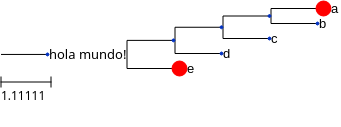
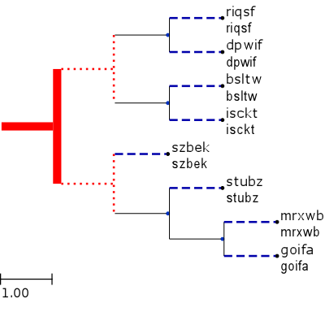
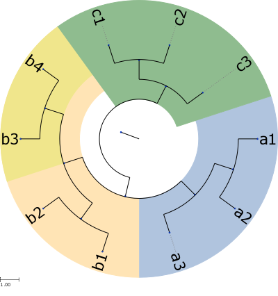
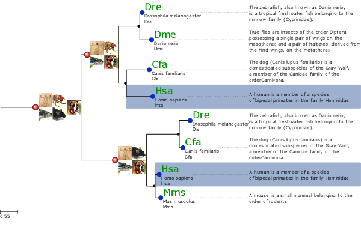
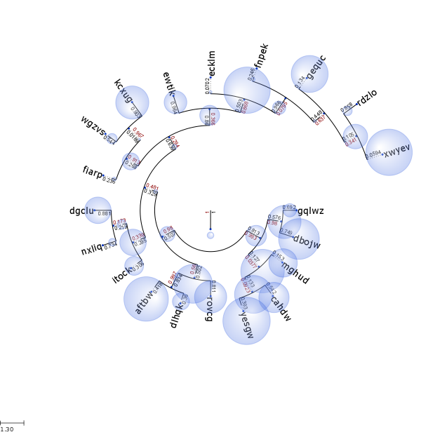
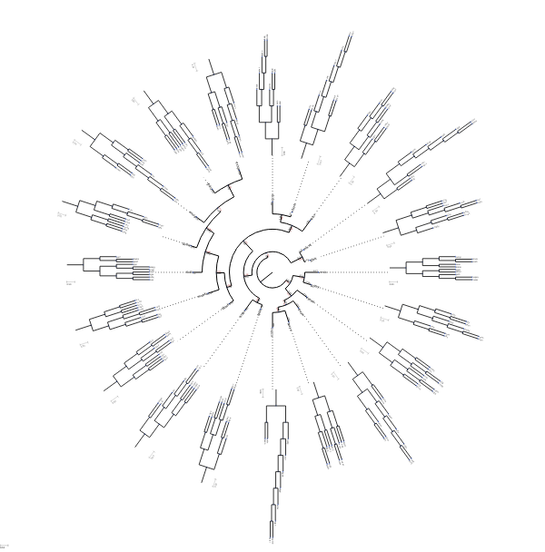
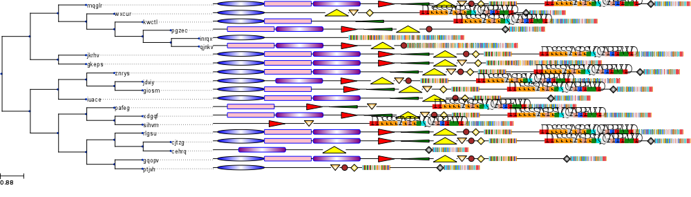
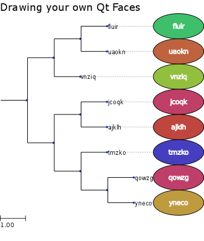

.. currentmodule:: ete4.treeview

Tree drawing (Qt)
=================

.. contents::

Overview
--------

ETE's treeview extension provides a highly programmable drawing system
to render any hierarchical tree structure as png, svg or pdf images.

Although several predefined visualization layouts are included with
the default installation, custom styles can be easily created from
scratch.

Image customization is performed through four elements:

* :class:`TreeStyle`, sets general options about the image (shape,
  rotation, etc.)
* :class:`NodeStyle`, defines the specific aspect of each node (size,
  color, background, line type, etc.)
* :class:`faces <Face>`, small pieces of extra graphical information that
  can be added to nodes (text labels, images, graphs, etc.)
* :attr:`layout` functions, normal python functions that controls how
  node styles and faces are dynamically added to nodes

Images can be rendered using the :func:`render <ete4.Tree.render>`
method, or interactively visualized using a built-in GUI invoked by
the :func:`show <ete4.Tree.show>` method.

Interactive visualization of trees
----------------------------------

ETE's tree drawing engine is fully integrated with a built-in
graphical user interface (GUI) which allows to explore and manipulate
node's properties and tree topology. To start the visualization of a
node (tree or subtree), you can simply call the :func:`show
<ete4.Tree.show>` method.

One of the advantages of this visualization is that you can use it to
interrupt a given program/analysis, explore the tree, manipulate it,
and continue with the execution. Note that **changes made using the
GUI will be kept after quiting the GUI**. This feature is specially
useful during python sessions, where analyses are performed
interactively.

::

  from ete4 import Tree
  t = Tree('((a,b),c);')
  t.show()

The GUI allows many operations to be performed graphically. However it
does not implement all the possibilities of the programming toolkit.

Rendering trees as images
-------------------------

Tree images can be directly written as image files. Supported formats
are png, svg, and pdf. Note that while png images are raster images,
pdf and svg pictures are rendered as `vector graphics
<http://en.wikipedia.org/wiki/Vector_graphics>`_, thus allowing their
later modification and scaling.

To generate an image, the :func:`render <ete4.Tree.render>` method
should be used instead of :func:`show <ete4.Tree.show>`. The only
required argument is the file name, whose extension will determine the
image format (png, svg, or pdf). Several parameters regarding the
image size and resolution can be adjusted:

.. table::

  ============= ===================================================
  Argument      Description
  ============= ===================================================
  :attr:`units` ``px``: pixels, ``mm``: millimeters, ``in``: inches
  :attr:`h`     height of the image in :attr:`units`
  :attr:`w`     width of the image in :attr:`units`
  :attr:`dpi`   dots per inch
  ============= ===================================================

.. note::

   If :attr:`h` and :attr:`w` values are both provided, image size
   will be adjusted even if it requires breaking the original aspect
   ratio of the image. If only one value (:attr:`h` or :attr:`w`) is
   provided, the other will be estimated to maintain the aspect ratio.
   If no sizing values are provided, the image will be adjusted to A4.

::

  from ete4 import Tree
  t = Tree('((a,b),c);')
  t.render('mytree.png', w=183, units='mm')

Customizing the aspect of trees
-------------------------------

Image customization is performed through four main elements: *tree
style*, *node style*, *faces*, and *layouts*.

Tree style
~~~~~~~~~~

The :class:`TreeStyle` class can be used to create a custom set of
options that control the general aspect of the tree image. Tree styles
can be passed to the :func:`show <ete4.Tree.show>` and :func:`render
<ete4.Tree.render>` methods. For instance, :class:`TreeStyle` allows
to modify the scale used to render tree branches or choose between
circular or rectangular tree drawing modes.

::

  from ete4 import Tree
  from ete4.treeview import TreeStyle

  t = Tree('((a,b),c);')
  circular_style = TreeStyle()
  circular_style.mode = 'c'  # draw tree in circular mode
  circular_style.scale = 20
  t.render('mytree.png', w=183, units='mm', tree_style=circular_style)

A number of parameters can be controlled through custom tree style
objects. Check the :class:`TreeStyle` documentation for a complete
list of accepted values.

In the following, se show some common cases.

Show leaf node names, branch length and branch support
^^^^^^^^^^^^^^^^^^^^^^^^^^^^^^^^^^^^^^^^^^^^^^^^^^^^^^

Automatically add node names and branch information to the tree
image::

  from ete4 import Tree
  from ete4.treeview import TreeStyle
  t = Tree()
  t.populate(10, random_branches=True)
  ts = TreeStyle()
  ts.show_leaf_name = True
  ts.show_branch_length = True
  ts.show_branch_support = True
  t.show(tree_style=ts)

.. figure:: ../images/show_info.png

Change branch length scale (zoom in x)
^^^^^^^^^^^^^^^^^^^^^^^^^^^^^^^^^^^^^^

Increases the length of the tree by changing the scale::

  from ete4 import Tree
  from ete4.treeview import TreeStyle
  t = Tree()
  t.populate(10, random_branches=True)
  ts = TreeStyle()
  ts.show_leaf_name = True
  ts.scale = 120  # 120 pixels per branch length unit
  t.show(tree_style=ts)

.. figure:: ../images/scale_x.png

Change branch separation between nodes (zoom in y)
^^^^^^^^^^^^^^^^^^^^^^^^^^^^^^^^^^^^^^^^^^^^^^^^^^

Increases the separation between leaf branches::

  from ete4 import Tree
  from ete4.treeview import TreeStyle
  t = Tree()
  t.populate(10, random_branches=True)
  ts = TreeStyle()
  ts.show_leaf_name = True
  ts.branch_vertical_margin = 10  # 10 pixels between adjacent branches
  t.show(tree_style=ts)

.. figure:: ../images/scale_y.png

Rotate a tree
^^^^^^^^^^^^^

Draws a rectangular tree from top to bottom::

  from ete4 import Tree
  from ete4.treeview import TreeStyle
  t = Tree()
  t.populate(10)
  ts = TreeStyle()
  ts.show_leaf_name = True
  ts.rotation = 90
  t.show(tree_style=ts)

.. figure:: ../images/rotated_tree.png

Circular tree in 180 degrees
^^^^^^^^^^^^^^^^^^^^^^^^^^^^

Draws a circular tree using a semi-circumference::

  from ete4 import Tree
  from ete4.treeview import TreeStyle
  t = Tree()
  t.populate(30)
  ts = TreeStyle()
  ts.show_leaf_name = True
  ts.mode = 'c'
  ts.arc_start = -180  # 0 degrees = 3 o'clock
  ts.arc_span = 180
  t.show(tree_style=ts)

.. figure:: ../images/semi_circular_tree.png

Add legend and title
^^^^^^^^^^^^^^^^^^^^

::

  from ete4 import Tree
  from ete4.treeview import TreeStyle, TextFace
  t = Tree('((a,b),c);')
  ts = TreeStyle()
  ts.show_leaf_name = True
  ts.title.add_face(TextFace('Hello ETE', fsize=20), column=0)
  t.show(tree_style=ts)

Node style
~~~~~~~~~~

Through the :class:`NodeStyle` class the aspect of each single node
can be controlled, including its size, color, background and branch
type.

A node style can be defined statically and attached to several nodes.

Simple tree in which the same style is applied to all nodes::

  from ete4 import Tree
  from ete4.treeview import NodeStyle, TreeStyle

  t = Tree('((a,b),c);')

  # Basic tree style.
  ts = TreeStyle()
  ts.show_leaf_name = True

  # Draw nodes as small red spheres of diameter equal to 10 pixels.
  nstyle = NodeStyle()
  nstyle['shape'] = 'sphere'
  nstyle['size'] = 10
  nstyle['fgcolor'] = 'darkred'

  # Gray dashed branch lines
  nstyle['hz_line_type'] = 1
  nstyle['hz_line_color'] = '#cccccc'

  # Apply the same static style to all nodes in the tree. Note that
  # if 'nstyle' is modified, changes will affect all nodes.
  for n in t.traverse():
      n.set_style(nstyle)

  t.show(tree_style=ts)

.. figure:: ../images/node_style_red_nodes.png

If you want to draw nodes with different styles, an independent
:class:`NodeStyle` instance must be created for each node. Note that
node styles can be modified at any moment by accessing the
:attr:`img_style <ete4.Tree.img_style>` attribute.

Simple tree in which the different styles are applied to each node::

  from ete4 import Tree
  from ete4.treeview import NodeStyle, TreeStyle
  t = Tree('((a,b),c);')

  # Basic tree style.
  ts = TreeStyle()
  ts.show_leaf_name = True

  # Create an independent node style for each node, which is
  # initialized with a red foreground color.
  for n in t.traverse():
      nstyle = NodeStyle()
      nstyle['fgcolor'] = 'red'
      nstyle['size'] = 15
      n.set_style(nstyle)

  # Let's now modify the aspect of the root node
  t.img_style['size'] = 30
  t.img_style['fgcolor'] = 'blue'

  t.show(tree_style=ts)

.. figure:: ../images/node_style_red_and_blue_nodes.png

Static node styles, set through the :func:`set_style
<ete4.Tree.set_style>` method, will be attached to the nodes and
exported as part of their information. For instance, :func:`copy
<ete4.Tree.copy>` will replicate all node styles in the replicate
tree. Note that node styles can also be modified on the fly through
:ref:`layout functions <sec:layout_functions>`.

Node faces
~~~~~~~~~~

Node faces are small pieces of graphical information that can be
linked to nodes. For instance, text labels or external images could be
linked to nodes and they will be plotted within the tree image.

Several types of node faces are provided by the main :mod:`treeview`
module, ranging from simple text (:class:`TextFace`) and geometric
shapes (:class:`CircleFace`), to molecular sequence representations
(:class:`SequenceFace`).

A complete list of available faces can be found at the :mod:`treeview`
reference page.

Faces position
^^^^^^^^^^^^^^

Faces can be added to different areas around the node, namely
**branch-right**, **branch-top**, **branch-bottom** or **aligned**.
Each area represents a table in which faces can be added through the
:func:`add_face <ete4.Tree.add_face>` method. For instance, if you
want two text labels drawn below the branch line of a given node, a
pair of :class:`TextFace` faces can be created and added to the
columns 0 and 1 of the **branch-bottom** area::

  from ete4 import Tree
  from ete4.treeview import TreeStyle, TextFace
  t = Tree('((a,b),c);')

  # Basic tree style.
  ts = TreeStyle()
  ts.show_leaf_name = True

  # Add two text faces to different columns.
  t.add_face(TextFace('hola '), column=0, position='branch-bottom')
  t.add_face(TextFace('mundo!'), column=1, position='branch-bottom')
  t.show(tree_style=ts)

If you add more than one face to the same area and column, they will
be piled up. See the following image as an example of face positions:

.. figure:: ../images/face_positions.png
   :alt: possible face positions

(Source code to generate the above image: :download:`face_grid_tutorial.py
<../../examples/treeview/face_grid_tutorial.py>`)

.. note::

  Once a face object is created, it can be linked to one or more
  nodes. For instance, the same text label can be recycled and added
  to several nodes.

Face properties
^^^^^^^^^^^^^^^

Apart from the specific config values of each face type, all face
instances contain the same basic attributes that permit to modify
general aspects such as margins, background colors, border, etc. A
complete list of face attributes can be found in the general
:class:`Face` class documentation. Here is a very simple example::

  from ete4 import Tree
  from ete4.treeview import TreeStyle, TextFace

  t = Tree('(a,b);')

  # Basic tree style.
  ts = TreeStyle()
  ts.show_leaf_name = True

  # Create two faces.
  hola = TextFace('hola')
  mundo = TextFace('mundo')

  # Set some attributes.
  hola.margin_top = 10
  hola.margin_right = 10
  hola.margin_left = 10
  hola.margin_bottom = 10
  hola.opacity = 0.5 # from 0 to 1
  hola.inner_border.width = 1 # 1 pixel border
  hola.inner_border.type = 1  # dashed line
  hola.border.width = 1
  hola.background.color = 'LightGreen'

  t.add_face(hola, column=0, position='branch-top')
  t.add_face(mundo, column=1, position='branch-bottom')

  t.show(tree_style=ts)

.. figure:: ../images/face_borders.png

.. _sec:layout_functions:

Layout functions
~~~~~~~~~~~~~~~~

Layout functions act as pre-drawing `hooking functions
<http://en.wikipedia.org/wiki/Hooking>`_. This means that, before a
node is drawn, it is first sent to a layout function. Node properties,
style and faces can be then modified on the fly and returned to the
drawing engine. Thus, layout functions can be understood as a
collection of rules controlling how different nodes should be drawn.

::

  from ete4 import Tree
  t = Tree('((((a,b),c),d),e);')

  def abc_layout(node):
      vowels = {'a', 'e', 'i', 'o', 'u'}

      if node.name in vowels:
          node.img_style['size'] = 15
          node.img_style['fgcolor'] = 'red'
          # Note that the node style was already initialized with the
          # default values.

  # Tree style.
  ts = TreeStyle()
  ts.show_leaf_name = True
  ts.layout_fn = abc_layout

  # Add two text faces to different columns.
  t.add_face(TextFace('hola '), column=0, position='branch-right')
  t.add_face(TextFace('mundo!'), column=1, position='branch-right')

  t.show(tree_style=ts)

Combining styles, faces and layouts
-----------------------------------

Examples are probably the best way to show how ETE works:

Fixed node styles
~~~~~~~~~~~~~~~~~

.. literalinclude:: ../../examples/treeview/node_style.py

Node backgrounds
~~~~~~~~~~~~~~~~

.. literalinclude:: ../../examples/treeview/node_background.py

Img faces
~~~~~~~~~

.. literalinclude:: ../../examples/treeview/img_faces/img_faces.py

Note that images are attached to terminal and internal nodes.

Bubble tree maps
~~~~~~~~~~~~~~~~

.. literalinclude:: ../../examples/treeview/bubble_map.py

Trees within trees
~~~~~~~~~~~~~~~~~~

.. literalinclude:: ../../examples/treeview/tree_faces.py

Phylogenetic trees and sequence domains
~~~~~~~~~~~~~~~~~~~~~~~~~~~~~~~~~~~~~~~

.. literalinclude:: ../../examples/treeview/seq_motif_faces.py

Creating your custom interactive faces
~~~~~~~~~~~~~~~~~~~~~~~~~~~~~~~~~~~~~~

.. literalinclude:: ../../examples/treeview/item_faces.py

Note that the faces shown in this image are not static. When the tree
is viewed using the tree.show() method, you can interact with items.
