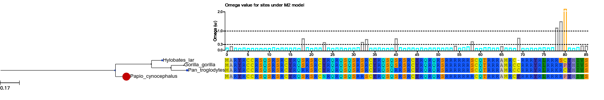
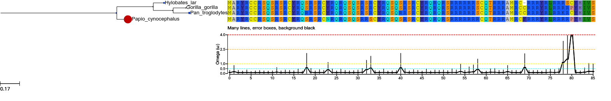
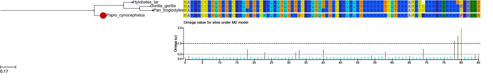

:Author: François Serra

.. currentmodule:: ete3

Testing Evolutionary Hypothesis
*******************************

.. contents::

Extension Requirements:
==========================

You should have codeml and slr in your path:

 * CodeML, you can download it from
   http://abacus.gene.ucl.ac.uk/software/paml.html

 * SLR, from here: http://www.ebi.ac.uk/goldman-srv/SLR/

Download, compile and install both of the programs, in order to be able to run the examples.

This ETE extension is written on top of these two external programs, so it is strongly recommended to read their corresponding documentation.

Overview
================

An other aspect in the study of evolutionary history, is the analysis of selective pressures accounting for the conservation or degeneration of **protein coding genes**.

The :class:`EvolTree` class is an extension of the class :class:`PhyloTree` that implements mainly bindings to the PAML package [yang2007]_ but also to the SLR program [massingham2005]_.

Evolutionary variables that are used to summary selective pressures are, of course the branch-length (*bL*) already available in :class:`PhyloTree`, but also the rate of non-synonymous mutations (*dN*), the rate of synonymous mutations (*dS*) and finally the :math:`\omega` ratio:

.. math::
  :nowrap:

  \begin{eqnarray}
    \omega = \frac{dN}{dS}
  \end{eqnarray}

The working directory
---------------------

EvolTree works mainly as PhyloTree, thus it needs a tree and an alignment. However as you are going to run external programs over it, **a working directory needs to be defined**. By default tree.workdiris "/tmp/ete3-codeml/", but it is recommended to change it to a more useful path.

Jobs will be stored in the workdir, and you will be able to load precomputed evolutionary models from there.

Descriptive analysis
====================

In order to identify the evolutionary trends in a phylogenetic tree, one can either:

  * conduct an analysis over branches and compute the value of
    :math:`\omega` in each of them.

  * look at the selective pressures along the alignment.

Branch model
--------------

As for :class:`PhyloTree`, we first load the tree and alignment (and you working directory, if you want to save a copy of your jobs):

::
  
  from ete3 import EvolTree

  tree = EvolTree("((Hylobates_lar,(Gorilla_gorilla,Pan_troglodytes)),Papio_cynocephalus);")
  
  tree.link_to_alignment ('''>Hylobates_lar
  ATGGCCAGGTACAGATGCTGCCGCAGCCAGAGCCGGAGCAGATGTTACCGCCAGAGCCGGAGCAGATGTTACCGCCAGAGGCAAAGCCAGAGTCGGAGCAGATGTTACCGCCAGAGCCAGAGCCGGAGCAGATGTTACCGCCAGAGACAAAGAAGTCGGAGACGAAGGAGGCGGAGCTGCCAGACACGGAGGAGAGCCATGAGGTGT---CGCCGCAGGTACAGGCTGAGACGTAGAAGCTGTTACCACATTGTATCT
  >Papio_cynocephalus	                                                                                          
  ATGGCCAGGTACAGATGCTGCCGCAGCCAGAGCCGAAGCAGATGCTATCGCCAGAGCCGGAGCAGATGTAACCGCCAGAGACAGAGCCAAAGCCGGAGAAGCTGCTATCGCCAGAGCCAAAGCCGGAGCAGATGTTACCGCCAGAGACAGAGAAGTCGTAGACGAAGGAGGCGACGCTGCCAGACACGGAGGAGAGCCATGAGGTGCTTCCGCCGCAGGTACAGGCTGAGGCGTAGGAGGCCCTATCACATCGTGTCT
  >Gorilla_gorilla	                                                                                          
  ATGGCCAGGTACAGATGCTGTCGCAGCCAGAGCCGCAGCAGATGTTACCGGCAGAGCCGGAGCAGGTGTTACCGGCAGAGACAAAGCCAGAGCCGGAGCAGATGCTACCGGCAGAGCCAAAGCCGGAGCAGGTGTTACCGGCAGAGACAAAGAAGTCGCAGACGTAGGCGGAGGAGCTGCCAGACACGGAGGAGAGCCATGAGGTGCTGCCGCCGCAGGTACAGACTGAGACGTAGAAGACCCTATCATATTGTATCT
  >Pan_troglodytes	                                                                                          
  ATGGCCAGGTACAGATGCTGTCGCAGCCAGAGCCGGAGCAGATGTTACCGGCAGAGACGGAGCAGGTGTTACCGGCAAAGGCAAAGCCAAAGTCGGAGCAGATGTTACCGGCAGAGCCAGAGACGGAGCAGGTGTTACCGGCAAAGACAAAGAAGTCGCAGACGAAGGCGACGGAGCTGCCAGACACGGAGGAGAGCCATGAGGTGCTGCCGCCGCAGGTACAGACTGAGACGTAAAAGATGTTACCATATTGTATCT''')  

  tree.workdir = '/path_to/my_working_directory/'

Once loaded we are able to compute selective pressure among the tree according to an evolutionary model. In this case, we will use free-ratio model:
::
  
  tree.run_model ('fb.example')
  
:func:`EvolNode.run_model` allows to run different evolutionary models (follow this link :func:`EvolNode.run_model` to see the full list of models available). By convention, the name of the model called is the first word, the rest of the string, after the dot, corresponds to its identifier in order to differentiate different runs of one model. We can thus either run "fb" model and "fb.something" with the same result, but they will be stored under different names instead of being overwritten.

Once computation is done, we can retrieve the :class:`evol.Model` object from the tree, with the :func:`EvolNode.get_evol_model` function.

::
  
  my_first_fb_model = tree.get_evol_model('fb.example')

  print my_first_fb_model

This last print statement would ouptut:

::

   Evolutionary Model fb.example:
          log likelihood       : -521.421323
          number of parameters : 13
          sites inference      : None
          sites classes        : None
          branches             : 
          mark: #0  , omega: None      , node_ids: 5   , name: NoName
          mark: #1  , omega: 0.0001    , node_ids: 6   , name: NoName
          mark: #2  , omega: 999.0     , node_ids: 4   , name: Papio_cynocephalus
          mark: #3  , omega: 999.0     , node_ids: 2   , name: Hylobates_lar
          mark: #4  , omega: 0.0001    , node_ids: 7   , name: NoName
          mark: #5  , omega: 0.1049    , node_ids: 1   , name: Gorilla_gorilla
          mark: #6  , omega: 0.5334    , node_ids: 3   , name: Pan_troglodytes

By default, the free-branch model is run with this parameters:

::

    print my_first_fb_model.get_ctrl_string()

    #      seqfile = algn
    #     treefile = tree
    #      outfile = out
    #  
    #       aaDist = 0
    #    fix_alpha = 1
    #        alpha = 0.0
    #  fix_blength = 0
    #    cleandata = 0
    #        clock = 0
    #    CodonFreq = 2
    #        getSE = 0
    #        icode = 0
    #    fix_kappa = 0
    #        kappa = 2
    #       Malpha = 0
    #       method = 0
    #        Mgene = 0
    #        model = 1
    #        ncatG = 8
    #        noisy = 0
    #      NSsites = 0
    #    fix_omega = 0
    #        omega = 0.7
    # RateAncestor = 0
    #      runmode = 0
    #      seqtype = 1
    #   Small_Diff = 1e-6
    #      verbose = 2

However, it is usually recommended to run one model several times with different starting values, and keep only the model with higher likelihood. Here an example, on how to do this.

::

  best_model = None
  best_lnl   = float('-inf')
  for starting_omega in [0.2, 0.7, 1.2]:
      tree.run_model('fb.'+str(starting_omega))
      current_model = tree.get_evol_model('fb.'+str(starting_omega))
      print 'current model log likelihood:', current_model.lnL
      if current_model.lnL > best_lnl:
          best_lnl = current_model.lnL
          best_model = current_model
      
Finally in order to have a quick look of the selctive pressures over our phylogeny:

::

  tree.show()

by default this will the picture obtained:

.. _fb_default-fig:

.. figure:: ../ex_figures/fb_default.png
  :scale: 50 %
      

Node size, and color dependant of the :math:`\omega` value. But other displays are available:

::

  from ete3.treeview.layouts import evol_clean_layout

  tree.show(layout=evol_clean_layout)

.. _fb_clean-fig:

.. figure:: ../ex_figures/fb_clean.png
  :scale: 62 %
  

With here :math:`\omega` ratios in red and also in gray the *dN* and *dS* values.

Site model
-----------

Another way to look at selective pressures, is to compute directly along the alignment, the value of :math:`\omega` for a whole column (putting all leaves together). For doing this, we can use for example the model M2 of CodeML or directly use SLR. As before we just have to:

::

  tree.run_model('M2')
  tree.run_model('SLR.lele')

and to display the results:

::

  tree.show (histfaces=['M2'])

when a site model is computed, an histface is automatically generated. Thus with this call, what we are doing is to draw the default histface corresponding to the model named M2.lala. This is the result:

.. _M2_default-fig:

However customizing this face is feasible:

::

  model2 = tree.get_evol_model ('M2')

  col2 = {'NS' : 'black', 'RX' : 'black',
          'RX+': 'black', 'CN' : 'black',
          'CN+': 'black', 'PS' : 'black', 'PS+': 'black'}

  model2.set_histface (up=False, kind='curve', colors=col2, ylim=[0,4], hlines = [2.5, 1.0, 4.0, 0.5], header = 'Many lines, error boxes, background black', hlines_col=['orange', 'yellow', 'red', 'cyan'], errors=True)

  tree.show(histfaces=['M2'])

.. _M2_error-fig:

or:

::

  col = {'NS' : 'grey', 'RX' : 'black',
         'RX+': 'grey', 'CN' : 'black',
         'CN+': 'grey', 'PS' : 'black', 'PS+': 'black'}
  model2.set_histface (up=False, kind='stick', hlines = [1.0,0.3], hlines_col=['black','grey'])

  tree.show(histfaces=['M2'])

.. _M2_super_profesional-fig:

The col dictionary contains the colors for sites detected to be under positive selection (PS), relaxation (RX), or conserved (CN). However, it is not a good idea to use them now as we do not know if there is indeed positive selection.

To be able to accept M2 results we will have to test this model against a null model.

Hypothesis Testing
===================

In order to know if the parameters estimated under a given model a reliable, we have to compare its likelihood to a null model.

Usually, the alternative model is a model that estimates the proportion of sites with :math:`\omega > 1` and we compare its likelihood with a null model, usually a model that do not (letting :math:`\omega <= 1`). This comparison is done through a likelihood ratio test. If the alternative model has the best fit than we are able to accept the possibility of :math:`\omega > 1`.

To see a non-exhaustive list of famous comparison see the documentation of the function: :func:`EvolNode.get_most_likely`

Test on sites
--------------

In order to know if some sites are significantly under positive selection, relaxed or conserved we have usually to compare 2 models. However using the model "SLR" we can directly infer positive selection or relaxation through the SLR program [massingham2005]_.

The most usual comparison, and perhaps the most robust, is the comparison of models M2 and M1.

::

  tree.run_model ('M1')
  tree.run_model ('M2')

  pval = tree.get_most_likely ('M2','M1')

  model2 = tree.get_evol_model('M2')

  print model2

  # Evolutionary Model M2:
  #        log likelihood       : -517.824749
  #        number of parameters : 11
  #        sites inference      : BEB, NEB
  #        sites classes        : 
  #           proportions: p0=0.98794   p1=0.00000   p2=0.01206   
  #           w          : w0=0.09887   w1=1.00000   w2=178.86153 
  #        branches             : 
  #           mark: #0, omega: 2.25526440485   , nodes paml_ids: 6 4 2 7 1 3  

  if pval < 0.05:
    print 'M2 model wins.'
    for s in range(len(model2.sites['BEB']['aa'])):
      if model2.sites['BEB']['p2'][s] > 0.95:
        print 'positively selected site %s at position: %s, with probability: %s' % (model2.sites['BEB']['aa'][s], s+1, model2.sites['BEB']['p2'][s])
  else:
    print 'M1 model is not rejected'

  # M2 model wins.
  # positively selected site P at position: 81, with probability: 0.96293

Each sites model, contains a dictionary 'model.sites' in which are stored the results of CodeML. These are displayed through the histface, but they are still accessible by digging a bit. 'site' dictionary usually contains the result of the NEB and BEB analysis (prefer the BEB when available). For each of BEB and NEB, the probability of belonging from one category of site is summarized by 'p0', 'p1' and 'p2' in the case of M2 model that have only 3 class of sites (p0, the probability of belonging to the first class of sites with :math:`\omega < 1`; p1, the probability of belonging to the second class of sites with :math:`\omega = 1`; p2, the probability of belonging to the third class of sites with :math:`\omega > 1`). *For details on the models and outputs, it is recommended to read PAML documentation.*

*Note that M1 and M2 models are making reference to the new versions of these models, with continuous omega rates (namely M1a and M2a in the PAML user guide).*

Test on branches
------------------

CodeML allows to test models that infer different selective pressures on a set of given branches. To do it, some branches of the tree are marked (usually with strings like this: '#1'). This is how to do it with ETE:

::

  marks = ['2', '3', '4']

  # mark a group of branches
  tree.mark_tree (marks, ['#1', '#1', '#1'])
  print tree.write ()

  # ((Hylobates_lar,(Gorilla_gorilla #1,Pan_troglodytes #1) #1),Papio_cynocephalus);

By doing this a branch model will compute different :math:`\omega` values in mark branches (usually called foreground :math:`\omega_{frg}`) and in the rest of the tree (usually called background :math:`\omega_{bkg}`).

Two kinds of branch models are usually used:
  * the free-branch model: were :math:`\omega_{frg}` and :math:`\omega_{bkg}` are free
  * the neutral-branch model: were :math:`\omega_{frg}` is fixed to one.
  * the M0 model: were all branches evolve at the same rate.

The comparison between free-branch and M0, will tell us if foreground branches have an :math:`\omega` significantly different from the rest of the tree.

And the comparison between free-branch and neutral-branch models will tell us if :math:`\omega_{frg}` is significantly higher than 1.

::

  tree.run_model ('b_free')
  tree.run_model ('b_neut')
  tree.run_model ('M0')

  b_free = tree.get_evol_model('b_free')

  print b_free

  # Evolutionary Model b_free.234:
  #      log likelihood       : -525.690213
  #      number of parameters : 9
  #      sites inference      : None
  #      sites classes        : None
  #      branches             : 
  #        mark: #0, omega: 0.157280451975  , nodes paml_ids: 6 4 2
  #        mark: #1, omega: 0.118462858241  , nodes paml_ids: 7 1 3

  if tree.get_most_likely ('b_free', 'M0') < 0.05:
      # branch models have a branches dictionary were keys corresponds to paml_id of nodes in the tree
      # select one of the marked branches
      frg_node = tree.search_nodes(_nid=2)[0]
      frg_pamlid = frg_node.paml_id 
      w_frg = bfree.branches[frg_pamlid]['w']
      # select one of the unmarked branches
      bkg_node = tree.search_nodes(_nid=1)[0]
      bkg_pamlid = bkg_node.paml_id 
      w_bkg = bfree.branches[bkg_pamlid]['w']
      print 'foreground branches evolving at omega value of %s significantly diferent from %s.' % (w_frg, w_bkg)

  if  tree.get_most_likely ('b_free', 'b_neut') < 0.05:
      print 'foreground branches are significantly different from 1.'

*for the given example, background and foreground are not different...*

Test on branch-sites
---------------------

An other popular test is the branch-site test contrasting model A and A1. This test allows to detect genes with some sites under positive selection.

this example shows how to run it over all branches in the tree:

::

  # also needs the M0 model as null model
  tree.run_model ('M0')

  for leaf in tree:
      leaf.node_id
      print '\n---------\nNow working with leaf ' + leaf.name
      tree.mark_tree ([leaf.node_id], marks=['#1'])
      print tree.write()
      # to organize a bit, we name model with the name of the marked node
      # any character after the dot, in model name, is not taken into account
      # for computation. (have a look in /tmp/ete3.../bsA.. directory)
      print 'running model bsA and bsA1'
      tree.run_model ('bsA.'+ leaf.name)
      tree.run_model ('bsA1.' + leaf.name)
      print 'p-value of positive selection for sites on this branch is: '
      ps = tree.get_most_likely ('bsA.' + leaf.name, 'bsA1.'+ leaf.name)
      rx = tree.get_most_likely ('bsA1.'+ leaf.name, 'M0')
      print str (ps)
      print 'p-value of relaxation for sites on this branch is: '
      print str (rx)
      if ps<0.05 and float (bsA.wfrg2a)>1:
          print 'we have positive selection on sites on this branch'
      elif rx<0.05 and ps>=0.05:
          print 'we have relaxation on sites on this branch'
      else:
          print 'no signal detected on this branch, best fit for M0'
      print '\nclean tree, remove marks'
      tree.mark_tree (map (lambda x: x.node_id, tree.get_descendants()),
                      marks=[''] * len (tree.get_descendants()), verbose=True)

  print tree.get_evol_model('bsA.Hylobates_lar')

  #  Evolutionary Model bsA.Hylobates_lar:
  #         log likelihood       : -521.203318
  #         number of parameters : 11
  #         sites inference      : BEB, NEB
  #         sites classes        : 
  #         foreground w: f0=0.06452   f1=1.00000   f2=3.15727   f3=3.15727   
  #         proportions : p0=0.00415   p1=0.00023   p2=0.94413   p3=0.05150   
  #         background w: b0=0.06452   b1=1.00000   b2=0.06452   b3=1.00000   
  #         branches             : 
  #         mark: #0  , omega: None      , node_ids: 5   , name: NoName
  #         mark: #0  , omega: None      , node_ids: 6   , name: NoName
  #         mark: #0  , omega: None      , node_ids: 4   , name: Papio_cynocephalus
  #         mark: #1  , omega: None      , node_ids: 2   , name: Hylobates_lar
  #         mark: #0  , omega: None      , node_ids: 7   , name: NoName
  #         mark: #0  , omega: None      , node_ids: 1   , name: Gorilla_gorilla
  #         mark: #0  , omega: None      , node_ids: 3   , name: Pan_troglodytes

Utilities
==========

Load precomputed evolutionary model
------------------------------------

When an evolutionary model is computed, the output is stored in *tree.workdir* and can be load afterwards. Inside *tree.workdir*, a new directory is created for each model you compute (if each model has a different name), thus to load one model:

::

  from ete3 import EvolTree

  tree = EvolTree("((Hylobates_lar,(Gorilla_gorilla,Pan_troglodytes)),Papio_cynocephalus);")
  
  tree.link_to_alignment ('''>Hylobates_lar
  ATGGCCAGGTACAGATGCTGCCGCAGCCAGAGCCGGAGCAGATGTTACCGCCAGAGCCGGAGCAGATGTTACCGCCAGAGGCAAAGCCAGAGTCGGAGCAGATGTTACCGCCAGAGCCAGAGCCGGAGCAGATGTTACCGCCAGAGACAAAGAAGTCGGAGACGAAGGAGGCGGAGCTGCCAGACACGGAGGAGAGCCATGAGGTGT---CGCCGCAGGTACAGGCTGAGACGTAGAAGCTGTTACCACATTGTATCT
  >Papio_cynocephalus
  ATGGCCAGGTACAGATGCTGCCGCAGCCAGAGCCGAAGCAGATGCTATCGCCAGAGCCGGAGCAGATGTAACCGCCAGAGACAGAGCCAAAGCCGGAGAAGCTGCTATCGCCAGAGCCAAAGCCGGAGCAGATGTTACCGCCAGAGACAGAGAAGTCGTAGACGAAGGAGGCGACGCTGCCAGACACGGAGGAGAGCCATGAGGTGCTTCCGCCGCAGGTACAGGCTGAGGCGTAGGAGGCCCTATCACATCGTGTCT
  >Gorilla_gorilla
  ATGGCCAGGTACAGATGCTGTCGCAGCCAGAGCCGCAGCAGATGTTACCGGCAGAGCCGGAGCAGGTGTTACCGGCAGAGACAAAGCCAGAGCCGGAGCAGATGCTACCGGCAGAGCCAAAGCCGGAGCAGGTGTTACCGGCAGAGACAAAGAAGTCGCAGACGTAGGCGGAGGAGCTGCCAGACACGGAGGAGAGCCATGAGGTGCTGCCGCCGCAGGTACAGACTGAGACGTAGAAGACCCTATCATATTGTATCT
  >Pan_troglodytes
  ATGGCCAGGTACAGATGCTGTCGCAGCCAGAGCCGGAGCAGATGTTACCGGCAGAGACGGAGCAGGTGTTACCGGCAAAGGCAAAGCCAAAGTCGGAGCAGATGTTACCGGCAGAGCCAGAGACGGAGCAGGTGTTACCGGCAAAGACAAAGAAGTCGCAGACGAAGGCGACGGAGCTGCCAGACACGGAGGAGAGCCATGAGGTGCTGCCGCCGCAGGTACAGACTGAGACGTAAAAGATGTTACCATATTGTATCT''')  
  tree.link_to_evol_model('/path_to/my_working_directory/fb.example/out', 'fb')

*Note:* :func:`EvolNode.link_to_evol_model` is also able to load directly :class:`evol.Model` objects.

Indeed all output files generated do not need to be kept, only a `pickle or cPickle <http://docs.python.org/library/pickle.html>`_ of the model for example.

Thus we can save a tree with all Models computed, after having run some models:

::

  # assume we already have run some models:
  for model in  tree._models:
      print tree.get_evol_model(model)

  #  Evolutionary Model M2.example:
  #         log likelihood       : -517.824749
  #         number of parameters : 11
  #         sites inference      : BEB, NEB
  #         sites classes        : 
  #            proportions : p0=0.98794   p1=0.00000   p2=0.01206   
  #            w           : w0=0.09887   w1=1.00000   w2=178.86192 
  #         branches             : 
  #            mark: #0, omega: 2.25526864047   , nodes paml_ids: 6 4 2 7 1 3
  #         
  #  Evolutionary Model M1.example:
  #         log likelihood       : -521.541845
  #         number of parameters : 9
  #         sites inference      : NEB
  #         sites classes        : 
  #            proportions : p0=0.94075   p1=0.05925   
  #            w           : w0=0.07025   w1=1.00000   
  #         branches             : 
  #            mark: #0, omega: 0.125334579074  , nodes paml_ids: 6 4 2 7 1 3

  # we save the whole tree into my_tree.pik
  from cPickle import dump

  out = open('my_tree.pik', 'w')
  dump (tree, out)
  out.close()

and load them:

::

  from cPickle import load

  
  out = open('my_tree.pik')
  tree = load(out)
  out.close()

  # and here the same result
  for model in  tree._models:
      print tree.get_evol_model(model)

  #  Evolutionary Model M2.example:
  #         log likelihood       : -517.824749
  #         number of parameters : 11
  #         sites inference      : BEB, NEB
  #         sites classes        : 
  #            proportions : p0=0.98794   p1=0.00000   p2=0.01206   
  #            w           : w0=0.09887   w1=1.00000   w2=178.86192 
  #         branches             : 
  #            mark: #0, omega: 2.25526864047   , nodes paml_ids: 6 4 2 7 1 3
  #         
  #  Evolutionary Model M1.example:
  #         log likelihood       : -521.541845
  #         number of parameters : 9
  #         sites inference      : NEB
  #         sites classes        : 
  #            proportions : p0=0.94075   p1=0.05925   
  #            w           : w0=0.07025   w1=1.00000   
  #         branches             : 
  #            mark: #0, omega: 0.125334579074  , nodes paml_ids: 6 4 2 7 1 3

this also can be done for one model alone:

::

  from cPickle import dump, load

  m2_to_save = tree.get_evol_model('M2.example')

  out = open ('m2.pik', 'w')
  dump(m2_to_save, out)
  out.close()

  # and then load it
  out = open ('m2.pik')
  m2_to_save = dump(out)
  out.close()

  tree.link_to_evol_model(m2_to_save)

References
==========

.. [yang2007] Yang, Z., PAML 4: phylogenetic analysis by maximum likelihood. Molecular biology and evolution 24: 1586-91. (2007)

.. [massingham2005] Massingham T. and Goldman N. Detecting amino acid sites under positive selection and purifying selection. Genetics 169: 1853-1762. (2005)
