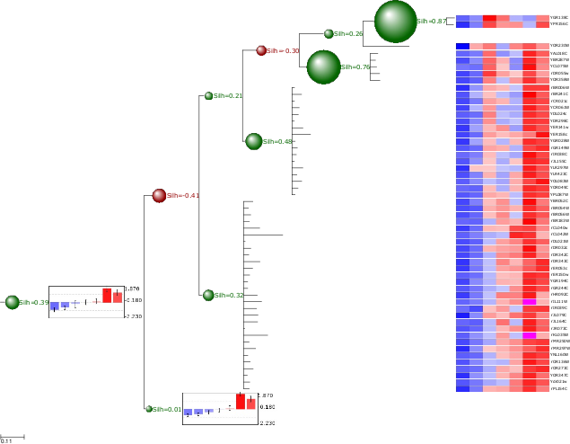

.. module:: ete2.clustering
  :synopsis: Extends Tree object: link trees to numeric matrices, perform cluster validation analysis, visualize node profiles
.. moduleauthor:: Jaime Huerta-Cepas
:Author: Jaime Huerta-Cepas

.. currentmodule:: ete2

Clustering Trees
****************

.. contents::

Overview
================

Cluster analysis is the assignment of a set of observations into
subsets (called clusters) so that observations in the same cluster are
similar in some sense.  Clustering is a method of unsupervised
learning, and a common technique for statistical data analysis used in
many fields, including machine learning, data mining, pattern
recognition, image analysis and bioinformatics. Hierarchical
clustering creates a hierarchy of clusters which may be represented in
a tree structure called a dendrogram. The root of the tree consists of
a single cluster containing all observations, and the leaves
correspond to individual observations. [The Wikipedia project
Jun-2009].

ETE provides special :class:`ClusterNode` (alias ClusterTree)
instances to deal with trees associated to a clustering analysis. The
basic difference between :class:`Tree` and :class:`ClusterTree` is
that leaf nodes in a cluster-tree are linked to numerical
profiles. Such profiles are expected to represent the data used to
generate the clustering tree.  In other words, trees are bound to
numerical arrays.

::

  #              /-A 
  #          ---|
  #              \-B 
  #  
  # #Names  col1   col2   col3
  # A       1.1    0.1    1.33
  # B       2.0    1.0    2.0
 

Based on this, :class:`ClusterTree` instances provide several several
clustering validation techniques that help in the analysis of cluster
quality. Currently, inter and intra-cluster distances, cluster
std.deviation, Silhouette analysis and Dunn indexes are supported. In
addition, ClusterTree nodes can be visualized using the
:class:`ProfileFace` face type, which can represent cluster profiles
in different ways, such as line plots, heatmaps or bar plots.

Although this type of trees are intended to be used for clustering
results, any tree that can be linked to a table (i.e. phylogenetic
profiles) could be loaded using this data type, thus taking advantage
of the profile visualization modes, etc.

Loading ClusterTrees
=======================

A :class:`ClusterTree` can be linked to a numerical matrix by using
the :attr:`text_array` argument.

::

  from ete2 import ClusterTree
   
  # Example of a minimalistic numerical matrix. It is encoded as a text
  # string for convenience, but it usally be loaded from a text file.
  matrix = """
  #Names\tcol1\tcol2\tcol3\tcol4\tcol5\tcol6\tcol7
  A\t-1.23\t-0.81\t1.79\t0.78\t-0.42\t-0.69\t0.58
  B\t-1.76\t-0.94\t1.16\t0.36\t0.41\t-0.35\t1.12
  C\t-2.19\t0.13\t0.65\t-0.51\t0.52\t1.04\t0.36
  D\t-1.22\t-0.98\t0.79\t-0.76\t-0.29\t1.54\t0.93
  E\t-1.47\t-0.83\t0.85\t0.07\t-0.81\t1.53\t0.65
  F\t-1.04\t-1.11\t0.87\t-0.14\t-0.80\t1.74\t0.48
  G\t-1.57\t-1.17\t1.29\t0.23\t-0.20\t1.17\t0.26
  H\t-1.53\t-1.25\t0.59\t-0.30\t0.32\t1.41\t0.77
  """
  print "Example numerical matrix"
  print matrix
  # #Names  col1    col2    col3    col4    col5    col6    col7
  # A       -1.23   -0.81   1.79    0.78    -0.42   -0.69   0.58
  # B       -1.76   -0.94   1.16    0.36    0.41    -0.35   1.12
  # C       -2.19   0.13    0.65    -0.51   0.52    1.04    0.36
  # D       -1.22   -0.98   0.79    -0.76   -0.29   1.54    0.93
  # E       -1.47   -0.83   0.85    0.07    -0.81   1.53    0.65
  # F       -1.04   -1.11   0.87    -0.14   -0.80   1.74    0.48
  # G       -1.57   -1.17   1.29    0.23    -0.20   1.17    0.26
  # H       -1.53   -1.25   0.59    -0.30   0.32    1.41    0.77
  #
  #
  # We load a tree structure whose leaf nodes correspond to rows in the
  # numerical matrix. We use the text_array argument to link the tree
  # with numerical matrix.
  t = ClusterTree("(((A,B),(C,(D,E))),(F,(G,H)));", text_array=matrix)

Alternatively, you can re-link the tree (or a sub-part of it) to a new
matrix using the :func:`ClusterNode.link_to_arraytable` method.

::
  
    t = ClusterTree("(((A,B),(C,(D,E))),(F,(G,H)));")
    t.children[0].link_to_arraytable(matrix1)
    t.children[1].link_to_arraytable(matrix2)

Once the tree is linked to a table of profiles, the following node
properties will be available: :attr:`PhyloNode.profile`,
:attr:`PhyloNode.deviation`, :attr:`PhyloNode.silhoutte`,
:attr:`PhyloNode.intercluster_dist`,
:attr:`PhyloNode.intracluster_dist`, :attr:`PhyloNode.dunn`.

Similarly, the following methods are provide for convenience
:func:`PhyloNode.iter_leaf_profiles`,
:func:`PhyloNode.get_leaf_profiles`, :func:`PhyloNode.get_silhouette`
and :func:`PhyloNode.get_dunn` methods.

Visualization of matrix associated Trees
========================================

Clustering or not, any ClusterTree instance, associated to a numerical
matrix, can be visualized together with the graphical representation
of its node's numeric profiles. To this end, the :class:`ProfileFace`
class is provided by the :mod:`treeview` module. This face type can
represent a node's numeric profile in four different ways:

  .. figure:: ../ex_figures/profile_faces.png 

Additionally, three basic layouts are provided that use different
styles of ProfileFace instances: **heatmap**, **line_profiles**,
**bar_profiles**, **cbar_profiles**.

.. literalinclude:: ../../examples/clustering/cluster_visualization.py
  

Cluster Validation Example
========================================

If associated matrix represents the dataset used to produce a given
tree, clustering validation values can be used to assess the quality
of partitions. To do so, you will need to set the distance function
that was used to calculate distances among items (leaf nodes). ETE
implements three common distance methods in bioinformatics :
**euclidean**, **pearson** correlation and **spearman** correlation
distances.

In the following example, a microarray clustering result is visualized
and validated using ETE.

      
Image resulting from a microarray clustering validation analysis. Red
bubbles represent a bad silhouette index (S<0), while green represents
good silhouette index (S>0). Size of bubbles is proportional to the
Silhouette index. Internal nodes are drawn with the average expression
profile grouped by their partitions. Leaf node profiles are shown as a
heatmap.

.. literalinclude:: ../../examples/clustering/bubbles_validation.py

